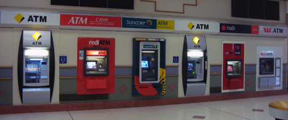
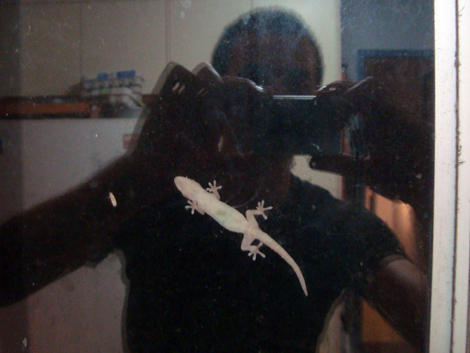
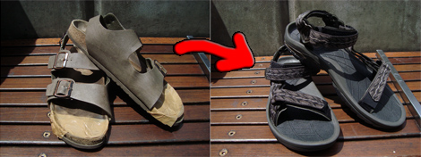
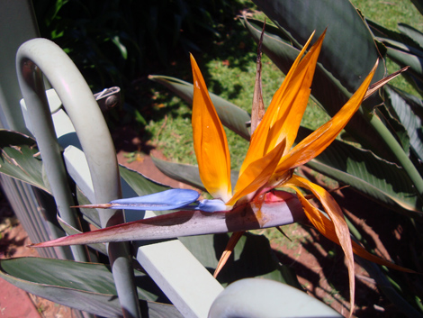
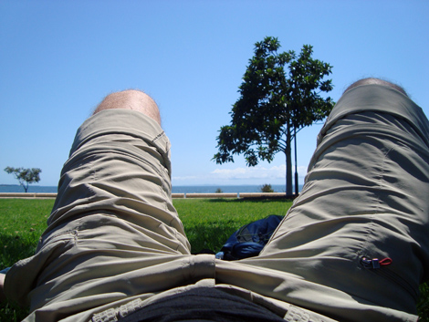
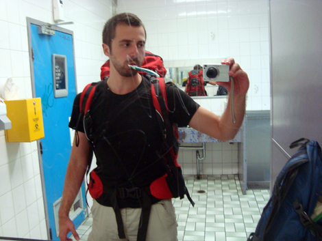

G'day mates!

The whopping 26 hours flight that I described in the previous post took me to Ozland, also known as Australia!

I was highly looking forward to it for a handful of reasons. First, I desperately wanted to buy a new MacBook Pro. 
Second, after all the time away from the Internet - well, away from the electricity altogether, that is during the Everest trek and at Bhim's village - I felt the urge to talk to my far away friends and loved ones. I could and I did in Kathmandu, but it took so much frustration it's hard to imagine for someone used to Western connectivity standards. All the prehistoric Internet cafés were ultra-cheap but also ultra-crappy and ultra-slow. IF there was connection at all. And (bigger if) IF there was electricity at all: the city would undergo power outages at any time, and the duration of the blackout was so unpredictable that it should be used as the ultimate generator of random numbers.
Finally, I was generally looking forward to go back to some structured tidyness and to a honk-free life.

And I definitely found everything that I could wish for and possibly more! This was one of the welcoming, remarkable sights of "Welcome Back to The Western World, Sir!"

I had arranged a couchsurfing in Brisbane, so after the third and last landing I took the train to Wellington Point, where my couch was. And I'm not sure I could have been luckier! Linda, my host, provided me with the best bed I'd had since the 30th of August, great food and help with anything I could need. On my first day we went shopping together, but another disappointment was round the corner: for some yet unknown reason, none of my cards worked and the fella at the shiny Apple Store was not able to pull money out of my accounts. Aaaargh! Back at home I called the bank and luckily, from the next day on everything was fine. This led me to fully plunge into what Linda calls the "retail therapy", and I bought so much stuff that I almost topped the daily limit for the first time in my life! That included the birth of my new toy on which I'm typing now! 

Another fruit of the retail therapy is a new pair of sandals: my glorious Birckenstocks, which actually dated back only to August 2003, had received a mortal blow when I did rafting and during the hike for Bhim's village, to the point that for their last 10 days of life I had been constantly repairing them with tape. Their successors are some Australian brand, slick-ass sandals that I bought in a big outdoor chain coincidentally called "Kathmandu"!

I will write a lot of impressions about Australia, but now I'm only going to mention the strongest two that came to my mind in Brisbane: a bit like in the outskirt US, everything is huge! Road, cars and shops. The mall where I bought the MacBook is no doubt the biggest one I have ever visited. There are even screens to provide maps to shops and amenities, I guess to prevent people from getting lost, and the food court is truly gigantic. It's the Chermside Mall, in case you're interested. I'm sure there are bigger malls, but I yet have to see them.
Second impression is about the nature. It's really different here. The unique kangaroos are just the tip of the iceberg: animals and plants here are different to a whole new scale. Scientifically, the Australian tectonic plate has been separated by the others for such a long time that things evolved in an unique way. This is for instance a flower that Linda has in her backyard, called the "Bird of Paradise". 

My few days in Brisbane went by in a relaxed mood, a sort of re-acclimatisation to something closer to my everyday life. Linda took me to the Wellington Point itself where we had a proper Sunday morning breakfast and laid on the grass in front of an amazingly blue ocean. Cool to see the Pacific again, after 4 years, only from the other side.

At the end of our last dinner together, I decided to go buy some dessert to thank Linda and her son Simon for their hospitality. Simon and I went to the shop, and he let me drive his car. Second time in my life driving on the left side, I kept triggering the wipers instead of the indicators and thrillingly drove on the wrong side of the road for a bit. At least I was cautios: Simon later stated that his car had never moved so slowly.

Soon, too soon, it was already time to pack Ferrino again and leave. Here's a picture of me at the Greyhound bus station of Brisbane. A feeling of deja-vù took me back to the States when I saw the company logo on the side of the vehicle, which would have carried me for quite a few hours towards North...

