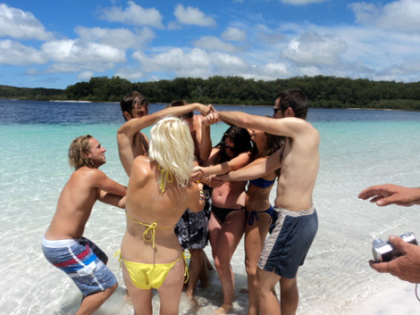
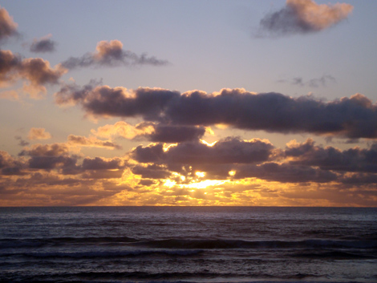

Howdy mates!

The Greyhound bus took me and two very nice Dutch guys from Brisbane to Hervey Bay, up along the Sunshine Coast. During the shopping frenzy I talked about in the previous post I had also booked a 4-night tour of Hervey Bay and Fraser Island, which is the biggest sand island in the world.
I was in a quite appropriate mood for it, as after all the diverse traveling you've been reading about, I felt actually ready for an easy, laid back, lazy touristic experience. Still, this wasn't the "resort" tourism, as sleeping bags and dune camping were on schedule. A good compromise.

As I got to Hervey Bay, I met the crowd that was going to share the adventure with me. We'll be a team of 24 people plus the most crazy, real guide you'll ever meet, called Worm (which I thought be "wArm", thanks Karen for the hint!). The vast majority was English, then a Scottish, two Irish, a couple of Canadians, a few Germans and I. A rather low average age (as low as 19, hey Saskia!) was the perfect premise for a fun, boozy time on a remote island!
After buying all the necessary food and alcol - which took me very long time, as Sean and Jack will remember - we got divided in three teams and three 4WD vans. Yeah, that's the only way to move around on the island, forget about asphalt: only sand and bumpy unpaved roads! A ferry took us there, and this would be a common view for the next days: riding on the beach, ocean on one side and forested hills on the other side.

We spent 3 days on the island, driving up and down to see fantastic spots, do whale watching or swim in some beautiful, fresh water lake. And play a lot! Jumping pictures, running and diving, walking on our hands and so forth, a total party atmosphere! We went along well, which is an important prerequisite for three intense days every minute together.

Swimming in the ocean was unfortunately too dangerous, due to strong currents but also to sharks and other nice pets: on the first night, four of us were on the shore, 20 meters away from our tents, and a fisherwoman a bit further down was fighting to pull out of the water what she believed was a very big fish. It turned out it was a big sting ray! On the sand, the thing kept flapping his wings and waving its poisonous spiky tail. Using the fishrods, the woman and I pushed it back towards the water, being uncomfortably close to the tail in doing so, till a wave seemed to claim it back.

Nature wise we could also spot some Dingoes (the slim, wild dogs living on the island). The next pic shows you yet another example of different nature, that I mentioned in the previous post: a kind of crossover between an ant and a spider that I'd never seen before!

During the second day, just after the lunch break, one of the vans broke down. This because the driver forgot to switch back to High Range from Low Range driving (Ben, please comment if I'm wrong), which took a few hours to sort out.
Just before, we had attended a fantastic didgeridoo show kindly offered by a friend of our guide. In Europe, usually you see that instrument played in squats, in the street or similar; here, it felt completely different and somehow more meaningful. 
The next morning, I woke up at 4:30 and dragged Karen (the Scottish of the crew) out of her tent to go witness the sunrise. Tough luck, it was cloudy all the way to the horizon. Still we had a nice chat and the show wasn't too bad after all, with those beautiful warm colors projected on water and clouds.

On the last night we spent all together some time on the beach. Finally, for the first time in Australia and therefore in my life, I could admire the night sky of the Southern Emisphere. What a gift! Imagine completely new constellations, including the Southern Cross and a few falling stars.
The last night was a true festive one: we played a game that involved a pink vest, downing something, singing a song of choice and choose the next victim. I was the first one, chosen directly by the unfathomable Wormy. Maybe due to the harmonica, I became actually quite central in the group's dynamics: we would yell my name for group photos, and there was this kind of stadium jingle with my name that the others would sing all the time!

Once got back to the hostel in Hervey Bay, we had the opportunity for a last dinner and club night together. This is the pic we took when I left earlier and announced that we wouldn't meet the next morning due to my plane at 6:45am. I'm more and more glad that Facebook exists.

