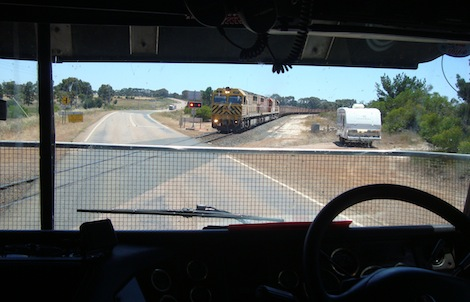
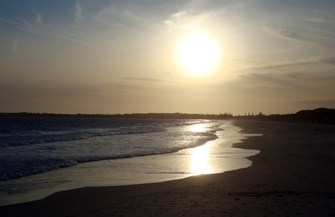

We spent two days in Esperance, on the shores of the Southern Ocean. Hard to believe before you go there, even though outside is sunny and very hot, the water will always be ice cold. Maybe because the other shore is Antarctica!

Here we stayed with some absolutely lovely people, some family of Becky. The husband of her sister is a truck driver, and one of the best experiences in town was to join him for a run! I had never been on such a truck nor really had an understanding of that kind of life, and I found the experience very fascinating.

The view is already different: it's high, and kind of "panoramic". Check this shot taken while waiting for that long train to pass! The little fence that you see is to protect the screen from stones.

It's harvest season down here, so our destination was a farm not far from town. At some point we took an unpaved road (here they say "unsealed") and drove through fields till we reached ours. Here, we found a few "harvesters", big machines that collect granola and put it into a big silo, where it'll wait for a truck to come. Once our track was parked next to the silos, the loading process could begin, and if you want you can climb the truck and see what's going on in the trailer!

Once the beast was fully loaded we took the way back towards Esperance. We were now carrying about 25 tons of stuff (if I remember correctly), and God you feel it! The initial acceleration was now so slow that it makes you wonder whether you'll be able to move or not.

The next step is to take the load to a sampling centre, where they decide if it's clean enough (stones or dirt might be in it) and the quality of the product, which ultimately sets the price. There, we had to go through a long queue of trucks as one of the sampling station was broken ("This is when the day turns to shit", was the initial comment of our friend! Luckily it wasn't too bad in the end.) If the samplers detect too much impurity, you need to go to a cleaning station and then come back to sample again. Fortunately this wasn't our case, so that we could proceed immediately to the collect point. The unloading was surprisingly quick: the truck stops on a special platform and the load is taken from below! The trailer opens and puff!, the load falls into its next container.

The whole thing was really fascinating as it gave me more awareness on what's going on before a product (cooking oil, in this case) hits the supermarket shelves, which we generally do know nothing about. This experience teamed up with the [goat sacrifice I attended in Nepal](http://ticofab.io/travel/2010-10-21-dashain_in_nepal_part_1/): both cases were about seeing what our food was before becoming food. There, the process couldn't have been more basic: kill the goat, chop it, cook it. Here in our part of the world, there are so many sophisticated layers in between, advanced technology and a huge number of intermediaries. And I've only seen the beginning! Imagine the processing that would come after, then the packaging and the shipping!

That evening we went for a walk on the beach, which rewarded us with a beautiful sunset. I don't know why our star looks so big in the picture!

The next day we went for the Great Ocean Drive, which touches several different beaches where you can descend. The first one had a huge rock next to it.

On another one, I took the usual "new animal" photo: a very big red ant with proper "clamps". The whole thing was 3 cm long!

Then we ventured into a national park nearby, and the most interesting thing we visited was the little Lucky Bay, also called "squeaky beach" as the sand is very fine and really does squeak when you walk on it! The water displayed a previously unseen blue color, which reminded me of the "Colgate Junior" toothpaste - hence my personal name, Toothpaste Beach.

I loved the days in Esperance, and I felt very lucky to meet these lovely people and their hospitality. I would like to close the post with what I called "Road Art" - which differs from "street art" as this one here is really about the road itself! I such a town there is not much to do after all, and every kid has some kind of big car. The result is what you see very often while driving around: drawings and patterns left by overdriven tyres. There were also circles and more complex ones. I regarded them as proper signatures on the road, left by the people who spend the most time on it.

