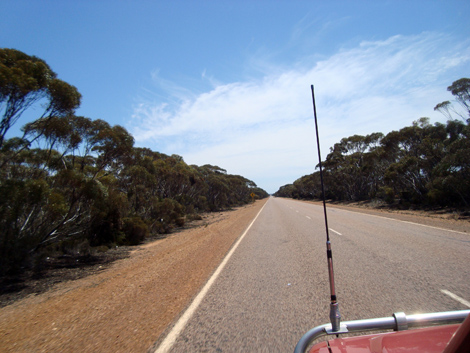
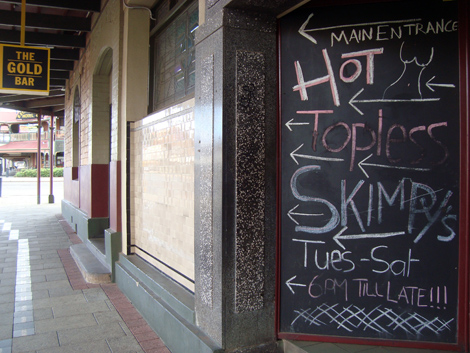

Heeey, how ya going?

We left Esperance in the late morning, for another leg of the roadtrip. Today's distance is shorter than the first day (described in [The Road to a Roadtrip](http://ticofab.io/travel/2010-11-12-the_road_to_a_roadtrip)), "only" 4 hours and a half, so no before-dawn departures.

Driving on these highways is very different than any European cruising experience. Roads are straight till the horizon most of the time and there is nothing next to them, except road signs here and there. No lights, no gas stations, no phones for emergencies and no guardrail.

At about 14:30 we reached our destination, Kalgoorlie, the most important of the mining centers of Western Australia up to date. Everything is about gold mining here, an activity which never stopped since the gold rush started in the 1890s - the oldest buildings in town look like the saloons and co. that we see in Western movies!

We visited the local museum, where I could finally see real Gold Nuggets - I'd read about them Uncle Scrooge's comics since I was a tiny kid!

We then jumped in the car again and went to the lookout on the Super Pit: the biggest open air gold mine in Australia, 3.8 km wide. It really is an impressive sight. Especially the machineries that are used, those building-sized trucks which carry 250 tons of rocks out of the mine. They are 6.5 meter tall and any human being could stand in the middle of the wheel! It costs some 2000 bucks to learn how to drive them and then all you get to do is go up and down the mine at soporific speed.

At that point it was about six, and we decided to begin a sort of "saloon crawl" through the local bars. Which introduced me to a unique feature I'd never seen before.

Being this a mining town, the market has developed around a very gender-unbalanced population where miner men are the absolute majority. There are plenty of strip clubs and brothels as usual, which is common in places built around typical male jobs (Amsterdam, anyone?), but here the phenomenon reaches such epic dimensions that a different form of entertainment has developed: the Skimpies.

They are basically waitress who only wear lingerie, and once the tip jar has been filled up by customers, take their bras off and work for 45 minutes topless, after which they go back to collecting tips till the jar is full again. As simple as that.

I was totally impressed. I had visited a proper strip club in the US, and there you find a lot of security, the atmosphere is kinda trashy and you are surrounded by frustrated, rich men in their 50ies. The situation here is the perfect tradeoff between that and your most relaxed local bar. No entrance fees, nothing: imagine places like Coco's in Amsterdam or _La Ragnatela_ in Rome, with a very normal crowd, and topless girls that walk around and chat to everybody. Unfortunately, no pictures were allowed, otherwise I would have taken heaps!

There were mostly miners there, all just back from work in their fluorescent jackets. We shared drinks with a few of them, all obviously totally used to the nudity and amused by seeing myself so amazed! I was listening to their stories about working in a mine and they actually confirmed my feeling that driving such a giant machine is only fun for the first hours, then it becomes a slow mammoth.

After that we went back to our hotel for a final drink and then to bed as many, many kilometers of paved and unpaved road were ahead of us the next day...