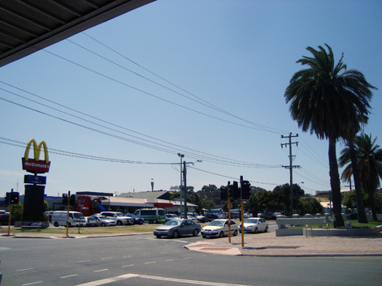
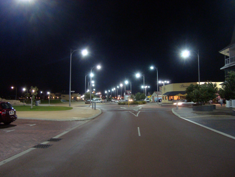
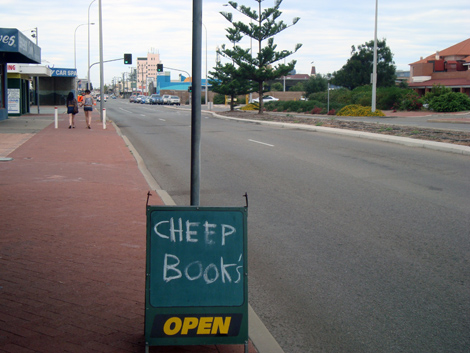
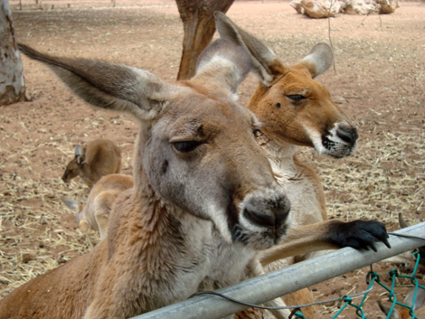
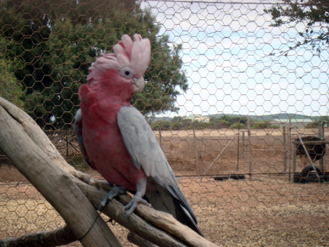
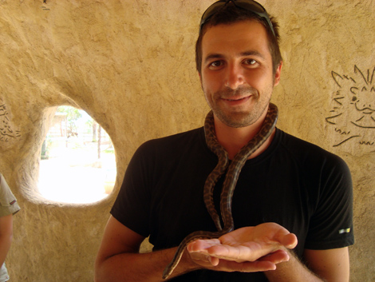
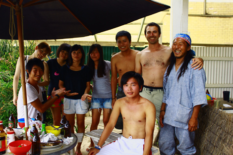

Yo yo - (Brazilian Laura would say I have a "yo yo obsession"),

In my previous post I tried to render the vibes of the Geraldton hostel life; here I will mention a few cool things to do outside! This post will have few(er) words and more images!

The town is quite small, so from the hostel I was able to walk to any supermarket or shop, anything would be within one km. Free wi-fi was the driving force behind a lot of my walking: unfortunately, the public library closed down for renovations just two days after I got there, so the only alternative was McDonald's connection. I finally understood why their air conditioning is so bad - to push the wireless junkies out.

As you can see, Geraldton is the typical outskirt town, with short but large buildings surrounded by wide roads. The night shot is the street between the hostel and the beach, fantastic for short walks at dusk.

I have also been surfing: this is the best available shot that a Nothern Irish friend took from the shore. Not a massive wave you'll notice, but hey, standing on the board is quite of a task already, for a beginner!

One day we went with the entire Taiwanese crew (plus a Japanese element) to a [Wildlife Park](http://www.wildlifeandbirdpark.com.au), 20 km south of Geraldton. Rather than the classic cagey zoo, it was a family run business with large open-air pens where animals roam around. Well, still not freedom I guess. Anyway, I am finally able to show the uttermost symbol of the nature peculiarity of this country: the kangaroo! Have you ever wondered why kangaroos, unique among the biggest mammals, hop? Because it's more efficient to cover long distances at medium speed! The energy of the bounce is stored in the tendons of the legs - much like in a pogo stick - while the intestines bounce up and down like a piston, emptying and fillings the lungs without need to activate the chest muscles. Brilliant and a total energy optimization when you have to travel long desert distances to find little food. They need one-fifth less food than equivalent size mammals!\nEverybody knows their shape, but probably few have seen them from so close. Their facial expression is phenomenal! Eyes barely open (maybe also for efficiency purposes?), they look like half asleep at the bar after a night out drinking!

Another cool pet to meet was the Australian pink parrot: as you approach, it pulls its feathers up and stretches one leg out, absolutely seductive! I have videos where it says things like "What are you doing?", "How is it going?", "Come on!" and so forth. I had actually never heard a parrot "speaking", so I found it pretty exciting!

Another funny thing was to be able to hold a baby python! At some point I had it around my neck, and the little fella, obviously eager to practice, began to tighten the grip! Not to any harmful level of course, but it definitely affected my breathing. I think my mixed feelings are well visible on my face - what a horrible death it must be to die strangled.

On the way home, we spotted another nature attraction of the zone: due to the constant massive wind, some trees have adapted to grow horizontally! This is no joke, nor an accident: they just grow like that, following the wind direction. Pretty amazing to see, that tree was maybe 10 or 15 meters long! There was one in the middle of the city but was quite smaller.

I loved the time in Geraldton as it gave me the opportunity to slow down a bit after two very fast months. It was totally "chillax" (as my friend Ash there would say) and cheap. I met loads of nice people with whom I'm sure I will stay in touch. If I think about it now, it feels like I've spent only two days there - time flies when you're having a good one.

