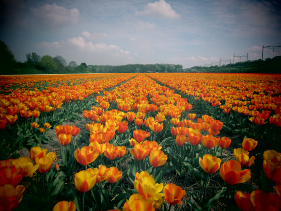

Mid-April, blossoming season in the Netherlands. Vast fields of dirt morph into a carpet of colors. Blue, yellow, purple, white, red. Tulips are the most sought sight, mainly because they're one of the national symbols, but a broad range of different flowers will delight your eyes: narcissi, hyacinths and the late lilies and dahlias. The country is the world's largest flower exporter--what farmers here work for are the bulbs, more than the flowers themselves.